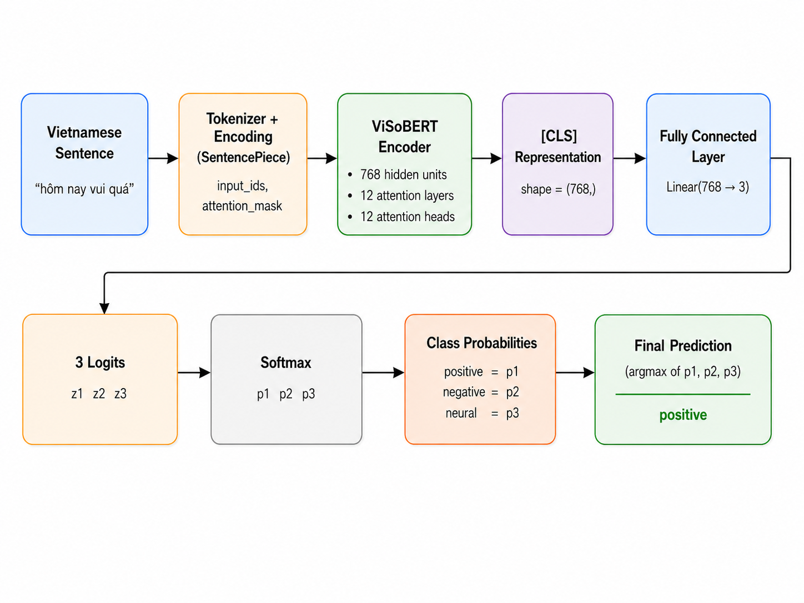

# 1 Kiến trúc mô hình

## Vấn đề
- Các PLMs tiếng Việt hoạt động chưa tốt trên dữ liệu mạng xã hội
- Dữ liệu social media chứa:
  - teencode
  - emojis
  - ngôn ngữ không chuẩn

---

## ViSoBERT

Mô hình Transformer theo kiến trúc XLM-R:

- 768 hidden units
- 12 attention layers
- 12 attention heads

### Training Objective
- Masked Language Modeling (MLM)

---

# 2 Vietnamese Social Media Tokenizer

## Ý tưởng
Xây dựng tokenizer riêng cho dữ liệu mạng xã hội tiếng Việt.

---

## SentencePiece

Sử dụng SentencePiece vì:

- Xử lý raw text tốt
- Giảm mất thông tin
- Phù hợp social media

---

## Ưu điểm của tokenizer

- Xử lý tốt:
  - teencode
  - emojis
  - từ viết tắt

- Tạo token ngắn và hiệu quả hơn
- Bao phủ dữ liệu tốt hơn các tokenizer cũ

---

## Kết quả

So với PhoBERT:

- Tokenization tốt hơn
- Hiểu văn bản informal tốt hơn
- Phù hợp social media hơn

# 3 Fine-tuning

## Hyperparameters

- Batch size: 40
- Max token length: 128
- Learning rate: 2e-5
- Optimizer: AdamW
- Epsilon: 1e-8
- Số epoch: 10

- Không áp dụng preprocessing trên dataset

### Mục tiêu
Đánh giá khả năng xử lý raw text của PLM trên dữ liệu mạng xã hội